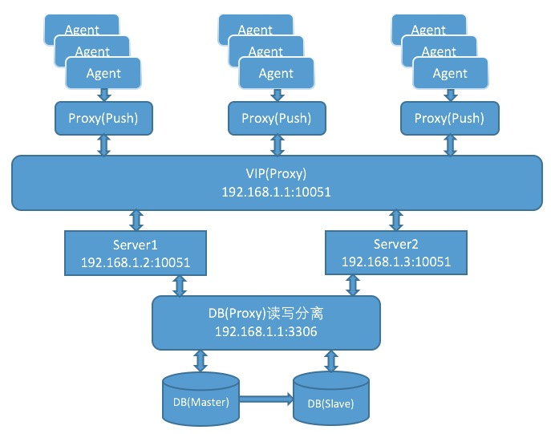

Zabbix监控部署文档
==

> 整体高可用架构方案



##### 高可用方案说明

  -	Agent根据 物理区域、应用分组等分组信息 组成Agent单元
  -	单元内Agent由Agent Proxy节点统一代理发送和响应Server请求
  -	Agent数据由统一代理层VIPProxy接收
  -	VIPProxy将数据分发到后端正常的Zabbix Server节点
  -	Zabbix Server节点之间文件做相互同步
  -	MySQL数据库做主从复制
  -	由MySQL Proxy 统一代理MySQL Master和Slave节点, 对外部应用提供接口
  -	MySQL Proxy实现应用层的读写分离

##### 方案优点
  + 前后端通过Proxy分离,架构解耦
  + 快速实现负载均衡、无缝迁移、分布式扩展等
  + Server节点可更具监控需求实现横向扩展
  + 数据库通过Proxy实现多节点高可用
  + 通过数据库Proxy实现应用层的读写分离,提高数据库处理性能

> Zabbix Server 安装

1.  安装环境

  ```
  硬件数量: 3台
  系统版本: CentOS 7.2
  VIPPorxy: 192.168.1.1
  网络环境: 192.168.1.2, 192.168.1.3
  ```
2.  初始安装

  ***注:本安装节点为 MySQL Master (192.168.1.2)***
  ```
  #单机部署
  #安装ansible环境
  $>sudo yum install epel-release
  $>sudo yum install ansible git

  #下载安装文件
  $>git clone https://github.com/dn365/sq-ansible.git

  #配置安装参数
  #MySQL 参数路径:sq-ansible/roles/geerlingguy.mysql/defaults/main.yml
  #Zabbix Server 参数路径:sq-ansible/roles/ansible-zabbix-server/defaults/main.yml

  #执行安装
  $>cd sq-ansible/roles/ansible-zabbix-server
  $>ansible-playbook -i "localhost," -c local playbook.yml

  #等待执行完成, 查看服务状态
  $>ps -ef|grep mysql
  $>ps -ef|grep zabbix
  $>ps _ef|grep httpd

  #本地添加zabbix web的域名解析
  例: 192.168.1.2 zabbix.dntmon.com

  #浏览器查看
  http://zabbix.dntmon.com
  初始管理员密码: Admin/zabbix
  ```

  ***注: MySQL Slave (192.168.1.3)***
  ```
  #具体安装步骤如Master节点
  #需要注意修改MySQL的安装配置参数

  #MySQL 配置文件
  $>vim sq-ansible/roles/geerlingguy.mysql/defaults
  #修改 mysql_server_id 参数值为 2
  #修改 mysql_replication_role 参数值为 slave

  #参照Master节点安装步骤完成其他步骤
  ```
>  MySQL 读写读写分离策略配置,使用oneproxy实现

  1.  下载地址:
      http://www.onexsoft.cn/software/oneproxy-rhel5-linux64-v5.8.5-ga.tar.gz
  2.  安装执行:

  ```
  #安装oneproxy
  #登录到测试服务器192.168.1.2上，执行:
  $>wget -S http://www.onexsoft.cn/software/oneproxy-rhel5-linux64-v5.8.5-ga.tar.gz
  $>tar zxvf oneproxy-rhel6-linux64-v5.8-ga.tar.gz
  $>mv oneproxy /usr/local/
  /usr/local/oneproxy/oneproxy --defaults-file=/usr/local/oneproxy/proxy.conf

  #配置测试数据库
  #主库：192.168.1.2
  #备库：192.168.1.3

  #分别在主库和备库上执行进行授权,确保在主库192.168.1.2可以连接主库和备库的zabbix库：
  $>grant all privileges on zabbix.* to 'zabbix'@'192.168.1.2' identified by 'zabbix';

  #配置oneproxy (请参考conf/oneproxy.conf)
  #更改 /usr/local/oneproxy/proxy.conf，如下:
  $>cat proxy.conf

  [oneproxy]
  keepalive = 1
  log-file  = /data0/log/oneproxy/oneproxy.log
  pid-file  = /data0/log/oneproxy/oneproxy.pid
  lck-file  = /data0/log/oneproxy/oneproxy.lck

  admin-address            = 127.0.0.1:4041
  proxy-address            = 127.0.0.1:3307
  proxy-master-addresses.1 = 192.168.153.49:3306@server1
  proxy-slave-addresses    = 192.168.42.145:3306@server1

  proxy-user-list          = zabbix/EA533C0350026E84DC33CF61D1BFE29A1E9F66CD@zabbix

  proxy-group-security     = server1:0
  proxy-group-policy       = server1:read-slave
  #注意proxy-user-list项中的密码，是按照如下方法生成的，直接填写数据库密码zabbix是不行的,我在这里折腾了好长时间，切记切记:

  $>/usr/local/oneproxy/oneproxy --defaults-file=/usr/local/oneproxy/proxy.conf

  $>mysql -uadmin -pOneProxy -h127.0.0.1 --port=4041

  Welcome to the MySQL monitor.  Commands end with ; or \g.
  Your MySQL connection id is 1
  Server version: 5.6.27 OneProxy-Admin-5.8.0 (OneXSoft)

  Copyright (c) 2000, 2013, Oracle and/or its affiliates. All rights reserved.

  Oracle is a registered trademark of Oracle Corporation and/or its
  affiliates. Other names may be trademarks of their respective
  owners.

  Type 'help;' or '\h' for help. Type '\c' to clear the current input statement.

  mysql> passwd zabbix;
  +--------+------------------------------------------+
  | TEXT   | PASSWORD                                 |
  +--------+------------------------------------------+
  | zabbix | EA533C0350026E84DC33CF61D1BFE29A1E9F66CD |
  +--------+------------------------------------------+
  1 row in set (0.00 sec)

  mysql>

  #启动oneproxy，并测试是否满足需要
  #启动，看日志正常，正常连接zabbix主库、从库

  $>/usr/local/oneproxy/oneproxy --defaults-file=/usr/local/oneproxy/proxy.conf

  #Log
  2015-12-21 11:18:08: (critical) plugin oneproxy 5.8.0 (Nov 10 2015) started
  2015-12-21 11:18:08: (critical) valid config checksum = 964137228
  2015-12-21 11:18:09: (critical) Ping backend (zabbix@192.168.1.2:3306) success, mark it up!
  2015-12-21 11:18:09: (critical) Ping backend (zabbix@192.168.1.3:3306) success, mark it up!

  #登录oneproxy，执行查询发现走的是从库，执行插入语句走的主库，证明配置正常
  ```
> Haproxy 安装以及配置

  ```
  # 下载安装文件
  $>git clone https://github.com/dn365/sq-ansible.git

  # 安装haproxy
  $>cd sq-ansible/roles/ansible-role-haproxy
  $>ansible-playbook -i "localhost," -c local playbook.yml

  # 等待执行完成, 查看服务状态
  $>ps -ef|grep haproxy

  # 替换haproxy.cfg配置文件
  # 请参考conf/haproxy.cfg
  ```
